```
    █████╗ ██████╗ ███╗   ███╗ ██████╗ ██████╗ ██████╗ ██╗  ██╗     █████╗ ██╗
   ██╔══██╗██╔══██╗████╗ ████║██╔═══██╗██╔══██╗██╔══██╗██║  ██║    ██╔══██╗██║
   ███████║██║  ██║██╔████╔██║██║   ██║██████╔╝██████╔╝███████║    ███████║██║
   ██╔══██║██║  ██║██║╚██╔╝██║██║   ██║██╔══██╗██╔═══╝ ██╔══██║    ██╔══██║██║
   ██║  ██║██████╔╝██║ ╚═╝ ██║╚██████╔╝██║  ██║██║     ██║  ██║    ██║  ██║██║
   ╚═╝  ╚═╝╚═════╝ ╚═╝     ╚═╝ ╚═════╝ ╚═╝  ╚═╝╚═╝     ╚═╝  ╚═╝    ╚═╝  ╚═╝╚═╝
```

## AI-Powered Ad Creative Engine

**Autonomous · Multi-Agent · Canva-Level Rendering**

[](https://python.org)
[](https://fastapi.tiangolo.com)
[](https://www.langchain.com/langgraph)
[](https://react.dev)
[](https://playwright.dev)
[](#-license)

> **AdMorph AI** is a high-performance, multi-agent advertising platform that turns a single product brief into **2,500+ premium ad variations**. It combines **LangGraph** orchestration, a **FastAPI** backend, and a **React** frontend to deliver a seamless, "Canva-level" creative pipeline — from strategy to export — powered entirely by autonomous AI agents.

[📖 Directory Breakdown](#-project-structure) · [🚀 Quick Start](#-quick-start) · [🎯 Features](#-key-features) · [🏗️ Architecture](#️-system-architecture) · [🤖 Agents](#-agent-pipeline)

---

## 📑 Table of Contents

| Core Sections | Technical Deep Dives | Resources |
|---|---|---|
| [🎯 Key Features](#-key-features) | [🤖 Agent Pipeline](#-agent-pipeline) | [📂 Project Structure](#-project-structure) |
| [🆚 Why AdMorph?](#-why-admorph) | [⚙️ Variant Engine](#️-variant-engine) | [🗺️ Roadmap](#️-roadmap) |
| [🏗️ System Architecture](#️-system-architecture) | [🎨 Template Library](#-template-library) | [⚙️ Configuration](#️-configuration) |
| [💬 UI Flow Walkthrough](#-ui-flow-walkthrough) | [📈 Heuristic Scoring](#-heuristic-scoring-engine) | [🐳 Deployment](#-deployment) |
| [🚀 Quick Start](#-quick-start) | [🛡️ Resilience](#️-technical-edge) | [👥 Contributing](#-contributing) |

---

## 🎯 Key Features

| Feature | Description |
|---|---|
| 🤖 **Multi-Agent Orchestration** | LangGraph-driven pipeline of specialized agents for strategy, copy, theme, and visuals |
| 📝 **AI Copy Generation** | Produces 50 unique high-conversion headlines, body copy, and catchy lines per brief |
| 🎨 **10 Dynamic Brand Themes** | Auto-generated CSS design tokens — Cyber Neon, Retro Pop, Bauhaus, Swiss Grid & more |
| 📐 **Combinatorial Variant Engine** | 50 Copies × 10 Themes × 5 Ratios = **2,500 ad variations** per campaign |
| 🖼️ **CleanSleeve™ Image Pipeline** | Local background removal (`rembg`) for clean product cutouts, no external API needed |
| 🖨️ **Headless Rendering** | Playwright-powered pixel-perfect PNG exports across every ratio (Square, Story, Banner…) |
| 🌍 **Localization & Voice** | Transcreation across languages plus AI voice-over generation via `edge-tts` |
| 📊 **Heuristic Scoring** | Every variant scored on urgency, emotion, readability & brand alignment |
| 🔌 **Multi-LLM Support** | Pluggable provider factory — OpenAI, Gemini, Anthropic, or local Ollama, with auto-retry |
| 🛡️ **Zero-AI Resilience** | Falls back to a hand-crafted, pattern-based copy engine if the LLM quota is hit |
| 🐳 **Production Ready** | Dockerized, Render-deployable with Gunicorn + Uvicorn workers |

---

## 🆚 Why AdMorph?

### 📊 Traditional Ad Tools vs. AdMorph AI

| Capability | Typical Ad Generator | **AdMorph AI** |
|---|---|---|
| **Input Method** | Manual copy + design per ad | ✨ 7-question AI brief extraction |
| **Copy Generation** | One-off, manually written | 📝 50 AI-generated headline/CTA sets |
| **Design Variety** | 1–2 static templates | 🎨 10 dynamically generated brand themes |
| **Output Volume** | Single creative per session | 📐 2,500 combinatorial variations |
| **Image Handling** | Manual cutout / stock search | 🖼️ CleanSleeve™ local background removal |
| **Rendering** | Design-tool dependent | 🖨️ Headless Playwright, pixel-perfect exports |
| **Resilience** | Fails without API access | 🛡️ Zero-AI fallback engine |
| **Localization** | None | 🌍 Transcreation + AI voice-over |
| **Deployment** | Manual / desktop-bound | 🐳 Docker + Render one-click deploy |

### 🎯 Key Differentiators

- **Multi-Agent** — Strategy, Copy, Theme, Image, and Layout agents each own a single responsibility
- **Combinatorial Scale** — One brief → thousands of ready-to-ship creatives
- **Fully Autonomous** — From brief to export with minimal human intervention

---

## 🏗️ System Architecture

```mermaid
graph TD
    User((👤 User)) -->|Start Campaign| API[⚡ FastAPI Routes]
    API -->|Prompting| IG[💬 Interactive Agent]
    IG -->|Extracted Brief| Graph[🕸️ LangGraph Orchestrator]

    subgraph AI_Pipeline["🤖 AI Pipeline"]
        Graph --> SC[🖼️ Sourcing / BG Removal]
        SC --> TG[🎨 Theme Agent]
        TG --> CG[📝 Copy Generator]
        CG --> VG[📐 Variant Engine]
    end

    VG -->|2,500 Variations| Render[🖨️ Headless Renderer]
    Render -->|PNG Exports| Finish((✅ Export Ready))

    style User fill:#0088CC
    style API fill:#009688
    style Graph fill:#1C3C3C
    style VG fill:#7C3AED
    style Render fill:#16A34A
```



*Four-phase pipeline: **Brief → Theming → Copy → Render***

---

## 🤖 Agent Pipeline

### 🔒 The Agentic Flow

```
┌──────────────────────────────────────────────────────────────────┐
│                    💬 USER BRIEFING SESSION                      │
│        7 strategic questions: product, UVP, audience...          │
└────────────────────────────┬───────────────────────────────────┘
                              │
          ╔═══════════════════▼══════════════════════════════════╗
          ║     💬  INTERACTIVE AGENT · Brief Collector          ║
          ║                                                      ║
          ║  ✓ Manages 7-question conversational loop            ║
          ║  ✓ Distills chat into structured product spec        ║
          ║  ✓ Supports local image upload or AI web sourcing    ║
          ╚═══════════════╤══════════════════════════════════════╝
                          │
          ╔═══════════════▼══════════════════════════════════════╗
          ║     🖼️  IMAGE AGENT · Sourcing & Cleanup             ║
          ║                                                      ║
          ║  ✓ Web sourcing of reference imagery                 ║
          ║  ✓ CleanSleeve™ background removal (rembg)           ║
          ╚═══════════════╤══════════════════════════════════════╝
                          │
          ╔═══════════════▼══════════════════════════════════════╗
          ║     🎨  THEME AGENT · Visual Design Tokens           ║
          ║                                                      ║
          ║  ✓ Generates 10 unique brand themes                  ║
          ║  ✓ Colors, fonts, radii as CSS design tokens          ║
          ╚═══════════════╤══════════════════════════════════════╝
                          │
          ╔═══════════════▼══════════════════════════════════════╗
          ║     📝  COPY AGENT · Ad Copy Generator                ║
          ║                                                      ║
          ║  ✓ 50 unique headlines, body copy, catchy lines       ║
          ║  ✓ Falls back to pattern-based engine if AI is down  ║
          ╚═══════════════╤══════════════════════════════════════╝
                          │
          ╔═══════════════▼══════════════════════════════════════╗
          ║     📐  VARIANT ENGINE · Combinatorial Expansion     ║
          ║                                                      ║
          ║  50 Copies × 10 Themes × 5 Ratios = 2,500 Ads         ║
          ║  ✓ Scored via Heuristic Scoring Engine                ║
          ╚═══════════════╤══════════════════════════════════════╝
                          │
          ╔═══════════════▼══════════════════════════════════════╗
          ║     🖨️  HEADLESS RENDERER · Playwright               ║
          ║                                                      ║
          ║  ✅ Output: PNG exports across all ratios             ║
          ║  💡 Square · Story · Banner · Portrait · Landscape    ║
          ╚════════════════════════════════════════════════════════╝
```

### 🔍 Agent Responsibilities

| Agent | Purpose | Key File | Output |
|---|---|---|---|
| 💬 **Interactive** | Brief collection | `interactive_agent.py` | Structured product brief |
| 🎯 **Strategy** | Campaign strategy | `strategy_agent.py` | Positioning & tone |
| 🖼️ **Image** | Sourcing & cleanup | `image_agent.py` | Cleaned product imagery |
| 🎨 **Theme** | Visual design | `theme_agent.py` | 10 CSS design tokens |
| 📝 **Copy** | Ad copywriting | `copy_agent.py` | 50 headline/CTA sets |
| 🖌️ **Visual** | Layout composition | `visual_agent.py`, `layout_agent.py` | Composed ad layouts |
| 🌍 **Localization** | Transcreation | `localization_agent.py` | Localized copy variants |
| 🕸️ **Graph** | Orchestration | `graph.py`, `orchestrator.py` | End-to-end run sequencing |

---

## ⚙️ Variant Engine

**50 Copies × 10 Themes × 5 Ratios = 2,500 unique ad creatives per campaign.**

```
╔══════════════════════════════════════════╗
║  INPUT 1 · COPY SETS (×50)               ║
║  Headline · Body content · Catchy line   ║
╠══════════════════════════════════════════╣
║  INPUT 2 · BRAND THEMES (×10)            ║
║  Cyber Neon · Retro Pop · Swiss Grid...  ║
╠══════════════════════════════════════════╣
║  INPUT 3 · EXPORT RATIOS (×5)            ║
║  Square · Story · Banner · Portrait...   ║
╚══════════════════════════════════════════╝
                     │
                     ▼
╔══════════════════════════════════════════╗
║     COMBINATORIAL VARIANT GENERATOR      ║
╚══════════════════════════════════════════╝
                     │
                     ▼
        2,500 rendered ad variations
```

## 📈 Heuristic Scoring Engine

Every variant is scored so the best-performing creatives surface first:

| Signal | Weight | Measures |
|---|---|---|
| Urgency | 30% | Time-pressure / call-to-action language |
| Emotion | 30% | Emotional resonance of headline + CTA |
| Readability | 20% | Clarity and reading ease |
| Brand Alignment | 20% | Fit with the selected tone |

```python
score = (0.3 * urgency) + (0.3 * emotion) + (0.2 * readability) + (0.2 * alignment)
```

---

## 💬 UI Flow Walkthrough

```
Phase 01 · Briefing (Interaction)
 → AI "Strategy Agent" asks 7 strategic questions
   (Product Name, UVP, Audience, etc.)
 → Supports local image upload or AI-powered web image sourcing

Phase 02 · Selection (Copy Selection)
 → View 50 high-conversion ad copy sets
   Headlines · Body content · Catchy lines

Phase 03 · Visuals (Theming)
 → View 10 unique brand themes dynamically generated
   Cyber Neon · Retro Pop · Minimal Premium · ...
 → Instant loading via synchronous state injection

Phase 04 · Masters (Ratio Selector)
 → Select preferred headline + theme combination
 → Preview final ad in 5 ratios (Square, Story, Banner, etc.)
 → Real-time polling for background-removed product images
```

---

## 🎨 Template Library

17 premium, hand-crafted HTML/CSS ad templates power every render:

| | | |
|---|---|---|
| Cyber Neon | Retro Pop | Minimal Premium |
| Bauhaus Modern | Swiss Grid | Bento Grid |
| Brutalist Raw | Editorial Magazine | Elegant Serif |
| Glassmorphism Vibe | Liquid Aurora | Urban Collage |
| Poster Template | Social Mimic | Instagram |
| Facebook | LinkedIn | |

---

## 📁 Project Structure

```
admorph-ai/
│
├── main.py                       Application entrypoint (FastAPI app)
├── config.py                     Pydantic-settings (env-driven)
│
├── agents/                       🤖 The Brain
│   ├── interactive_agent.py      BriefCollector — 7-question loop + LLM extraction
│   ├── strategy_agent.py         Campaign strategy & positioning
│   ├── copy_agent.py             CopyGenerator — 50 headline/content/catchy-line sets
│   ├── theme_agent.py            ThemeAgent — 10 CSS design-token themes
│   ├── image_agent.py            ImageAgent — web sourcing + background cleanup
│   ├── layout_agent.py           Layout composition logic
│   ├── visual_agent.py           Visual composition logic
│   ├── localization_agent.py     Transcreation across languages
│   ├── variant_engine.py         Combinatorial variant expansion
│   ├── state.py                  AdGenState — central session source of truth
│   ├── graph.py                  AdGenGraph — LangGraph pipeline definition
│   ├── orchestrator.py           Sequencing & coordination across agents
│   └── llm_factory.py            Multi-provider LLM factory with auto-retry
│
├── api/                           🔌 The Bridge
│   ├── routes.py                 /start-campaign, /submit-answer, /status,
│   │                              /preview-render, /render-single, /export-pack,
│   │                              /export-global, /transcreate-preview, /upload-image
│   └── schemas.py                Pydantic request/response models
│
├── engines/                       ⚙️ The Factory
│   ├── variant_engine.py         50 Copies × 10 Themes × 5 Ratios = 2,500 ads
│   └── voice_engine.py           AI voice-over generation (edge-tts)
│
├── services/                     🛠️ The Muscle
│   ├── image_service.py          rembg-based background removal (CleanSleeve™)
│   ├── renderer.py               Playwright snapshot rendering per ratio
│   ├── template_renderer.py      Jinja2 dynamic template selection
│   ├── editor_service.py         Post-generation editing logic
│   ├── optimization.py           Output optimization utilities
│   ├── cache_service.py          Response / asset caching
│   ├── openai_service.py         OpenAI provider integration
│   └── pixabay_service.py        Stock image sourcing
│
├── scoring/
│   └── heuristic_scoring.py      Urgency · Emotion · Readability · Brand alignment
│
├── models/
│   ├── db.py                     SQLAlchemy engine/session setup
│   └── entities.py                ORM models
│
├── utils/
│   ├── color_utils.py            HEX contrast detection & brand color parsing
│   ├── text_utils.py             Readability / emotion / urgency scoring helpers
│   └── platform.py               Platform-specific helpers
│
├── templates/                     🎨 The Design (17 ad templates)
│   ├── cyber_neon.html, retro_pop.html, minimal_premium.html, ...
│
├── frontend/                      ⚛️ React + Vite + Tailwind UI
│   ├── src/
│   ├── public/
│   └── package.json
│
├── database/
│   └── schema.sql                 Database schema
│
├── tests/
│   └── verify_pipeline.py         End-to-end pipeline verification
│
├── Dockerfile / docker-compose.yml   Postgres + Redis services
├── render.yaml                    Render.com deployment config
├── build.sh                       Build script for deployment
├── requirements.txt               All Python deps pinned
└── .env.example                   Environment variable template
```

---

## 🚀 Quick Start

**1 · Clone & configure**
```bash
git clone <repo-url> && cd admorph-ai
cp .env.example .env
# Edit .env: LLM_PROVIDER, LLM_API_KEY, LLM_MODEL, PIXABAY_API_KEY
```

**2 · Backend setup (Python)**
```bash
python -m venv .venv
source .venv/bin/activate   # Windows: .venv\Scripts\activate
pip install -r requirements.txt
playwright install chromium   # required for rendering
```

**3 · Frontend setup (React)**
```bash
cd frontend
npm install
```

**4 · Run the application**
```bash
# Terminal 1 — from project root
python main.py

# Terminal 2 — from frontend/
npm run dev
```

**5 · Docker (production)**
```bash
docker-compose up -d          # Postgres + Redis
docker build -t admorph-ai .
docker run -d --env-file .env -p 8000:8000 admorph-ai
```

---

## ⚙️ Configuration

| Variable | Default | Purpose |
|---|---|---|
| `APP_NAME` | `AdMorph Agentic Ads Platform` | Application display name |
| `DATABASE_URL` | `sqlite:///./admorph.db` | Database connection string |
| `LLM_PROVIDER` | `openai` | `openai` · `google` · `grok` · `anthropic` |
| `LLM_API_KEY` | **required** | API key for the selected provider |
| `LLM_MODEL` | `gpt-4o` | Model name (e.g. `gemini-1.5-pro`) |
| `PIXABAY_API_KEY` | optional | Enables AI-powered web image sourcing |
| `OUTPUT_DIR` | `generated` | Directory for rendered exports |
| `API_BASE_URL` | `http://127.0.0.1:8000` | Base URL used by the frontend/backend |

---

## 🐳 Deployment

Deploys out of the box on **Render.com** via `render.yaml`:
- Build: `build.sh` (installs deps + Playwright browsers)
- Start: `gunicorn main:app --worker-class uvicorn.workers.UvicornWorker`
- `docker-compose.yml` provisions Postgres + Redis for local/staging use

---

## 🛡️ Technical Edge

- **Zero-AI Resilience** — if the AI quota is hit, the system falls back to a hand-crafted engine of 50 pattern-based copies
- **CleanSleeve™ Technology** — automatic product subject isolation via local background removal, no external API required
- **Real-Time Polling** — the frontend keeps users informed of background processing status throughout generation

---

## 🗺️ Roadmap

| Stage | Status | Description |
|---|---|---|
| 1 | ✅ Done | Interactive brief collection + LangGraph orchestration |
| 2 | ✅ Done | Copy, Theme & Image agents with multi-provider LLM support |
| 3 | ✅ Done | Combinatorial variant engine (2,500 ad output) |
| 4 | ✅ Done | Headless Playwright rendering across 5 ratios |
| 5 | ✅ Done | Localization, voice-over & heuristic scoring |
| 6 | 🔲 Planned | Async job queue (Redis) · analytics dashboard · A/B test export |

---

## 👥 Contributing

Contributions, issues, and feature requests are welcome. Feel free to fork the repo and open a pull request.

---

### 🛠️ Built With

[Python](https://python.org) · [FastAPI](https://fastapi.tiangolo.com) · [LangGraph](https://www.langchain.com/langgraph) · [React](https://react.dev) · [Vite](https://vitejs.dev) · [Tailwind CSS](https://tailwindcss.com) · [Playwright](https://playwright.dev)

---

### ⭐ Star this repo if you find it useful!

Made with ❤️ by the AdMorph AI team | © 2026 AdMorph AI | All Rights Reserved
