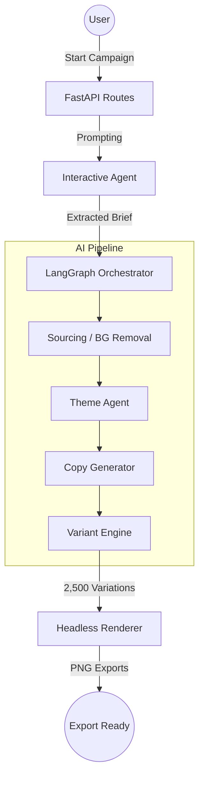

# 🚀 AdMorph: AI-Powered Ad Creative Engine

AdMorph is a high-performance, multi-agent advertising platform designed to generate 2,500+ premium ad variations from a single product brief. It leverages **LangGraph**, **FastAPI**, and **React** to create a seamless "Canva-level" design experience powered by advanced AI.

---

## 🛠️ Getting Started (From Scratch)

### 1. Backend Setup (Python)
1. **Navigate to the project root**:
   ```bash
   cd c:/project/AdTech/admorph
   ```
2. **Create a virtual environment**:
   ```bash
   python -m venv .venv
   ```
3. **Activate the environment**:
   - Windows: `.venv\Scripts\activate`
   - Mac/Linux: `source .venv/bin/activate`
4. **Install Dependencies**:
   ```bash
   pip install -r requirements.txt
   ```
5. **Install Playwright Browsers** (Required for rendering):
   ```bash
   playwright install chromium
   ```
6. **Configure Environment**:
   - Create a `.env` file based on `.env.example`.
   - Add your `GOOGLE_API_KEY` or `OPENAI_API_KEY`.

### 2. Frontend Setup (React)
1. **Navigate to the frontend directory**:
   ```bash
   cd frontend
   ```
2. **Install Node modules**:
   ```bash
   npm install
   ```

### 3. Running the Application
1. **Start Backend** (from project root):
   ```bash
   python main.py
   ```
2. **Start Frontend** (from `frontend` directory):
   ```bash
   npm run dev
   ```

---

## 🕹️ UI Flow & Functionality

1. **Phase 01: Briefing (Interaction)**
   - The user engages with an AI "Strategy Agent".
   - **Flow**: Answer 7 strategic questions (Product Name, UVP, Audience, etc.).
   - **Feature**: Supports local image upload or AI-powered web image sourcing.

2. **Phase 02: Selection (Copy Selection)**
   - View 50 high-conversion ad copy sets (Headings, Content, Catchy Lines).
   - **Logic**: AI generates these based on the extracted brief.

3. **Phase 03: Visuals (Theming)**
   - View 10 unique brand themes dynamically generated for your product.
   - **Themes**: Cyber Neon, Retro Pop, Minimal Premium, etc.
   - **Feature**: Instant loading via synchronous state injection.

4. **Phase 04: Masters (Ratio Selector)**
   - Select your preferred headline and theme.
   - Preview the final ad in 5 different ratios (Square, Story, Banner, etc.).
   - **Feature**: Real-time polling for background-removed product images.

---

## 📐 System Architecture



---

## 📂 Directory & File Breakdown

### 🤖 `agents/` (The Brain)
- **`interactive_agent.py`**: 
  - `BriefCollector`: Manages the 7-question loop and LLM brief extraction.
  - `_extract_brief`: Distills conversation into structured product specs.
- **`copy_agent.py`**:
  - `CopyGenerator`: Produces 50 unique ad headings, content blocks, and catchy lines.
- **`theme_agent.py`**:
  - `ThemeAgent`: Designs 10 visual CSS design tokens (colors, fonts, radii).
- **`image_agent.py`**:
  - `ImageAgent`: Coordinates web scraping for reference images and background cleaning.
- **`state.py`**:
  - `AdGenState`: The central source of truth for all data throughout the session.
- **`graph.py`**:
  - `AdGenGraph`: Defines the sequential logic of the AI agents using LangGraph.
- **`llm_factory.py`**:
  - `get_llm`: Handles multi-provider support (Gemini, OpenAI, Ollama) with auto-retry.

### 🔌 `api/` (The Bridge)
- **`routes.py`**:
  - `/start-campaign`: Initializes session.
  - `/submit-answer`: Processes user input and triggers sync/async generation.
  - `/status`: Real-time state polling for the frontend.
- **`schemas.py`**: Data validation models using Pydantic.

### ⚙️ `engines/` (The Factory)
- **`variant_engine.py`**:
  - `VariantGenerator`: Performs a combinatorial expansion of 50 Copies x 10 Themes x 5 Ratios = 2,500 ads.

### 🛠️ `services/` (The Muscle)
- **`image_service.py`**:
  - `ImageService`: Uses `rembg` (CleanSleeve) for background removal.
- **`renderer.py`**:
  - `Renderer`: Uses `Playwright` to take snapshots of HTML templates at specific ratios.
- **`template_renderer.py`**: Logic for dynamic Jinja2 template selection.

### 🎨 `templates/` (The Design)
- Contains 10 premium CSS designs including:
  - `cyber_neon.html`, `retro_pop.html`, `minimal_premium.html`, `bauhaus_modern.html`, and `swiss_grid.html`.

### 🧰 `utils/` (The Helpers)
- **`color_utils.py`**: HEX contrast detection and brand color parsing.
- **`text_utils.py`**: Linguistic analysis for readability and emotional "punch".

---

## 📈 Technical Edge
- **Zero-AI Resilience**: If AI quota is hit, system falls back to a hand-crafted engine of 50 pattern-based copies.
- **CleanSleeve™ Technology**: Automatic product subject isolation via local background removal.
- **Real-Time Polling**: Frontend keeps user informed of background processing status.
